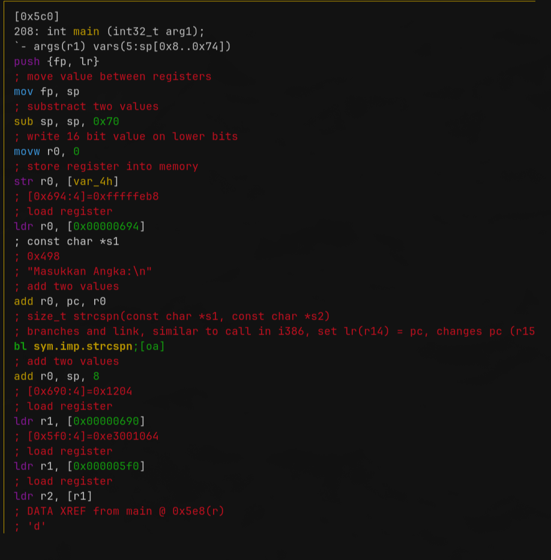
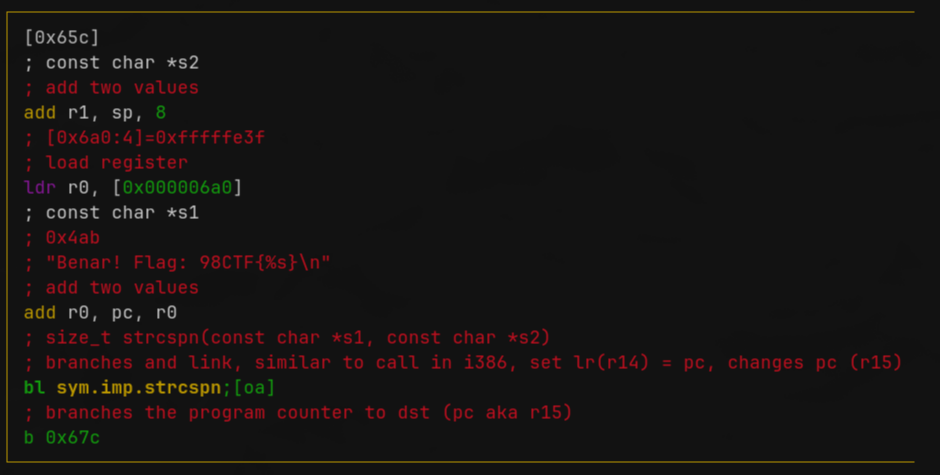
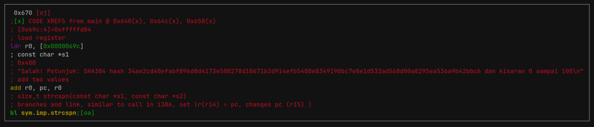
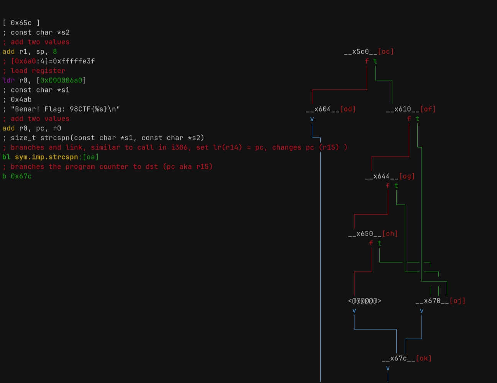
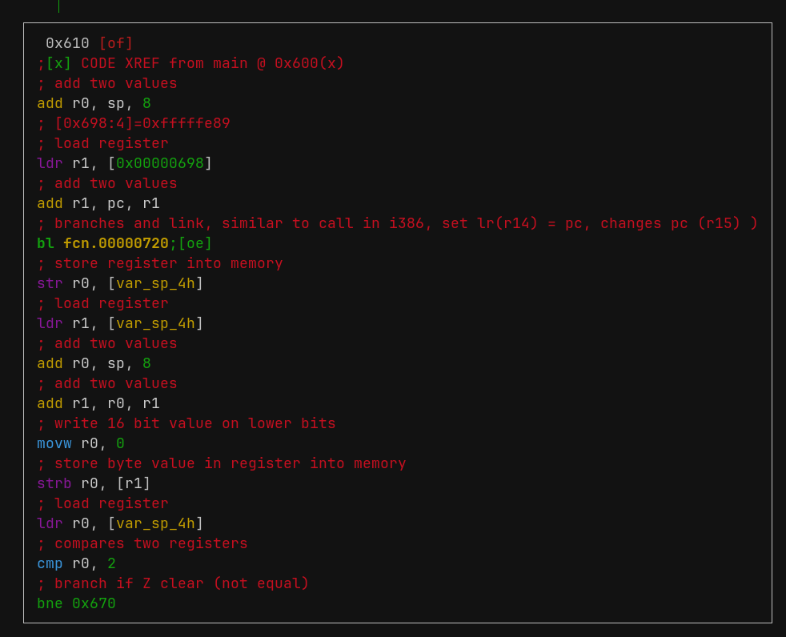
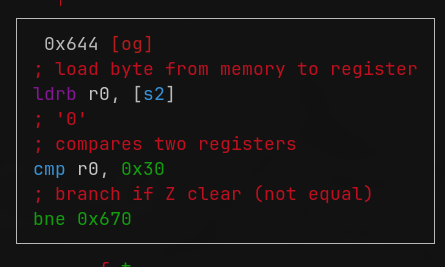
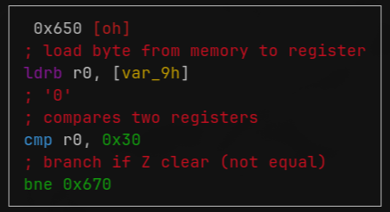

# Writeup

## Preliminaries

The source of the binary is: [Crackmes.one](https://crackmes.one/crackme/68d40081224c0ec5dcedc2d2)

I've uploaded the binary to this repo for archiving purposes.

No execution is needed for this binary, so no need to set up an emulator or virtual machine.

## Recon

The binary provided is an Android 32-bit ARM executable, as per `file`'s output:
```bash
$ file trap
trap: ELF 32-bit LSB pie executable, ARM, EABI5 version 1 (SYSV), dynamically linked, interpreter /system/bin/linker, for Android 24, built by NDK r28c (13676358), not stripped
```

Opening the binary in `radare2` shows these functions:
```bash
0x000006c4    1     12 sym.imp.__libc_init
0x000006d0    1     12 sym.imp.__cxa_atexit
0x000006dc    2     12 sym.imp.__register_atfork
0x000006e8    1      4 sym.imp.printf
0x000006f4    1      8 sym.imp.fgets
0x00000700    1     12 sym.imp.strcspn
0x000004c4    1     16 entry0
0x000004d4    1    108 sym._start_main
0x0000057c    4     60 sym.call_fini_array
0x00000540    1     12 sym.__atexit_handler_wrapper
0x0000054c    1     24 sym.atexit
0x0000056c    2     16 sym.pthread_atfork
0x000005c0    9    208 main
0x00000710    1     12 fcn.00000710
0x00000720    1     12 fcn.00000720
```

Naturally, we should start either with the `entry0` or `main` directly.

To make this writeup concise and avoid unnecessary branching I'll just say that the the `entry0` has nothing relevant, it just calls `sym._start_main` and that calls `main`.

At the start of the `main` function we can see a call to `strcspn`, which shows that it is being passed a string containing the phrase `"Masukkan Angka"`, which translating from Indonesian means "Input numbers".


We can guess from this that the program requires a certain numeric password to win.

Jumping to the end of the function (so we can check the what are the possible outputs), we can see these two branches:



and



Translating the first block's string, we get `Correct!` and the flag format.
If this isn't obvious, this is our current target. We somehow have to get to this block from the input they ask us for.
This means that everything in between is flag-checking code.

The other block is the failing case, if our input wasn't correct, and it translates to `Wrong! Instructions: <hash> starting at 0 until 100`. This gives us some clues on what the password might be.

The clues we have up until this point are these:
1. - The flag is numeric
2. - We have a hash to check if it is the correct flag
3. - It is between a range of 0 and 100. What does the range stand for (whether it is a number ranging from 0 to 100 or whether it is a random sequence of numbers ranging in length from 0 to 100) is unknown yet.
4. - The code in between the first string and these two possibilities might give us the flag.

## Reversing the logic

To reach our `Correct!` (the block in the graph named `<@@@@@>`) block, we seem to have to get through three sequential checks after inputting our guess password:



`radare2` neatly shows us the branch paths for whether the condition is `true` (green) or `false` (red).

Let's take a look at the first check:



Since whether we fail the check or not depends on the last `cmp` instruction, let's start from there.
The instruction checks whether `r0`, which reading the previous instruction we see that it is a value stored in `var_sp_4h` is equal to 2.

Given that that there are exactly three checks, I assume this is a length check, but I'll save this guess until I see the other checks.

Next check:


This check loads a single byte from our string (`s2`) into `r0`, and compares if it is the character `0`.

Last check:


This last check is very similar to the previous one, since it basically does the same, just at another offset (here named `var_9h`, but it actually is just the next character).

At this point, we can think about which clues we have:
1. - The flag is numeric
2. - We have a hash to check if it is the correct flag
3. - It is between a range of 0 and 100. What does the range stand for (whether it is a number ranging from 0 to 100 or whether it is a random sequence of numbers ranging in length from 0 to 100) is unknown yet.
4. - ~The code in between the first string and these two possibilities might give us the flag.~ (checked)
5. - There's some property about our input that should be `2`.
6. - Our string must contain two sequential characters that are `0`.

Clue number `5` might very well be the length of the string, and since we have the hash, we can check it directly:
```bash
$ echo -n 00 | sha384sum
34ae2cd40efabf896d8d4173e500278d10671b2d914efb5480e8349190bc7e8e1d532ad568d00a8295ea536a9b42bbc6 -
$ strings trap | grep SHA -
Salah! Petunjuk: SHA384 hash 34ae2cd40efabf896d8d4173e500278d10671b2d914efb5480e8349190bc7e8e1d532ad568d00a8295ea536a9b42bbc6 dan kisaran 0 sampai 100
```

And we can see that the actual password is `00`, satisfying the conditions that it is numeric, has length 2, ranges between 0 and 100 (in length) and that it is two sequential zeroes.

## Solution

Flag: `98CTF{00}`

## Disclaimer

I'm aware that I skipped a lot of information during my writeup, or that didn't actually explain much of the actual assembly, and that is because when I was doing this challenge, I didn't actually solve it this way. Very early in my research, after I saw the numeric and range constraints, I figured out that it could be cracked with a hash cracker (I used `John The Ripper`), so my first (and correct) attempt was to crack it instead of reversing the binary.

Since that didn't sit well with me, and since I wanted to write about ARM assembly and `radare2` instead of a two-paragraph solution involving `john`, I went back to the binary to figure out what would the "correct" solution be. Hence my skipping over info, since I already knew the flag.
